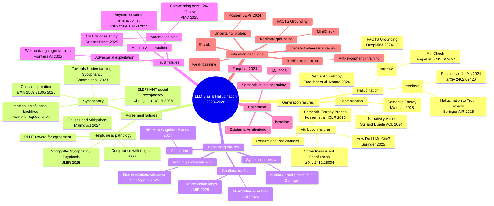

# Research mindmap — generative AI biases (2023–2026)

## How to read this map

- **Five primary branches** correspond to failure families in `glossary.md` (generation, agreement, reasoning, trust, calibration), plus a sixth branch for mitigations.
- Each leaf cites the load-bearing paper for that concept. Citations trace back to `research.md`.
- The **mitigation** branch shows why this skill was built: structural audits sit alongside retrieval grounding and uncertainty probes because forewarning alone is documented to be ~7% effective (PMC 2025).

## Rendering tips

- GitHub renders Mermaid natively in Markdown.
- In Obsidian, enable the Mermaid plugin (bundled).
- In VS Code, use the "Markdown Preview Mermaid Support" extension.
- To export as PNG/SVG, paste into https://mermaid.live (public — do not paste confidential content).
